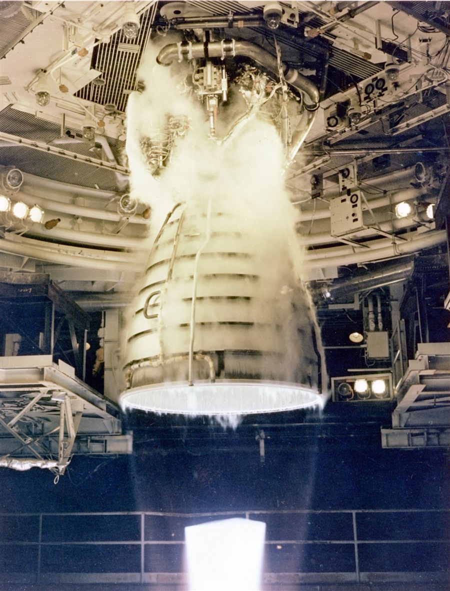

# Raketengleichung — Angeleitetes Übungsblatt :rocket:

Eine Rakete beschleunigt, indem sie fortlaufend Treibstoff nach hinten ausstößt. Anders als bei den meisten Mechanik-Aufgaben ist hier die **Masse des Systems nicht konstant**, das macht die Bewegungsgleichung interessant. Auf diesem Blatt leitet ihr die *Raketengleichung* (Ziolkowski-Gleichung) selbst her, löst sie, und untersucht, was sie über echte Raumfahrt aussagt.

Arbeitet die Abschnitte der Reihe nach durch, jeder baut auf dem vorherigen auf.

### Vokabeln

**Inertialsystem**: Massen verharren in Ruhe oder gleichförmig geradliniger Bewegung. Bezugsystem in dem die Newtonschen Gesetze in einfacher Form gelten.

**Austrittsgeschwindigkeit**: Geschwindigkeit des ausgestoßenen Treibstoffs *relativ zur Rakete*.

**Spezifischer Impuls**: Kenngröße für die Effizienz eines Triebwerks (Definition in Abschnitt 3).

**Delta-v ($\Delta v$)**: die Geschwindigkeitsänderung, die eine Rakete mit ihrem Treibstoffvorrat maximal erreichen kann.

**LEO** (Low Earth Orbit): niedriger Erdorbit, typische Höhe 200–2000 km.

---

## 1. Raketengleichung herleiten

### 1.1 Ausgangssituation

Endlich: Eine Rakete schwebt im Weltraum und zündet ihr Triebwerk. Wie schnell wird diese Rakete fliegen wenn der Treibstoff vollständig verbraucht ist? Das wollen wir jetzt herausfinden.

Betrachtet die Rakete zum Zeitpunkt $t$ in einem festen Inertialsystem: Sie hat Masse $M$ und Geschwindigkeit $v$. Im Zeitintervall $dt$ stößt sie ein kleines Massepaket $dm$ nach hinten aus, mit Austrittsgeschwindigkeit $u$ relativ zur Rakete (konstant, entgegen der Flugrichtung).

Das feste Inertialsystem könnt ihr euch in guter Näherung als Fixsternsystem vorstellen, das heißt ein Koordinatensystem, dessen Achsen auf die als unbeweglich geltenden Fixsterne ausgerichtet sind.

**Aufgabe:**
1. Skizziert die Situation vor und nach dem Ausstoß: Welche Massen und Geschwindigkeiten treten auf (im Inertialsystem, nicht relativ zur Rakete)?
2. Notiert den Gesamtimpuls des Systems (Rakete + Treibstoffpaket) **vor** dem Ausstoß.
3. Notiert den Gesamtimpuls **nach** dem Ausstoß. Achtung: Das ausgestoßene Paket hat im Inertialsystem *nicht* die Geschwindigkeit $u$, sondern $u$ relativ zur (sich bewegenden) Rakete.
4. Nutzt Impulserhaltung und stellt nach dem neuen Impuls der Rakete um.

### 1.2 Übergang zu infinitesimalen Größen

- Drückt die neue Geschwindigkeit der Rakete aus durch $v + dv$. Wiederholung: $dm$ ist die infinitesimale (sehr kleine) Masse des ausgestoßenen Treibstoffpakets und $dv$ die infinitesimale Änderung der Raketengeschwindigkeit nach dem Ausstoß von $dm$.
- Vernachlässigt Terme, die in zwei infinitesimalen Größen gleichzeitig auftreten (z. B. $dm \cdot dv$). Sie sind eine Größenordnung kleiner als die übrigen Terme.
- Bringt eure Gleichung in eine Differentialgleichung für $dv$. Nutzt dabei, dass sich die Raketenmasse $M$ nach dem Austoß um $dm$ reduziert, d.h. $dM = -dm$

### 1.3 Die Raketengleichung

- Überprüft die resultierende Differentialgleichung.
- Beschreibt in eigenen Worten, was jeder Term bedeutet ($dv$, $u$, $dM$, $M$) und warum das Vorzeichen so ist, wie es ist.
- Formuliert in einem Satz: Auf welche physikalische Frage gibt diese Differentialgleichung eine Antwort?

---

## 2. Raketengleichung lösen

### 2.1 Trennung der Variablen

- Löst die Differentialgleichung aus 1.3 durch Trennung der Variablen.
- Der Integrationsschritt: Integriert vom Startzustand mit $M(t_i) = M_i$, $v(t_i) = v_i$ bis zu einem beliebigen späteren Zustand mit $M(t_f) =M_f$, $v(t_i) = v_f$.
- Das Ergebnis ist die **Ziolkowski-Gleichung**.

### 2.2 Lösung plotten

- Plottet $\Delta v$ als Funktion des Massenverhältnisses $M_i/M_f$ mit `matplotlib` (linearer Plot).
- Variiert dabei $u$. Was ändert sich am Graphen?
- Dreht die Perspektive um: Plottet das **benötigte Massenverhältnis** $M_i/M_f$ als Funktion des **gewünschten** $\Delta v$ — diesmal mit logarithmischer y-Achse (`plt.yscale("log")`). Vergleicht das mit derselben Darstellung auf linearer y-Achse, was fällt auf?

### 2.3 Kritische Reflexion

- Schaut euch eure logarithmische Darstellung aus 2.2 an: Wie verhält sich das benötigte Massenverhältnis, wenn ihr den gewünschten $\Delta v$ immer weiter (linear) steigert? Was bedeutet das für die benötigte Treibstoffmenge?
- Schaut euch die Lösung zusätzlich für $M_f \to 0$ an. Was fällt auf, wenn ihr das im Kontext echter Raumfahrt interpretiert? Ist das realistisch?

---

## 3. Definition des spezifischen Impulses

### 3.1 Definition

Es gibt zwei gebräuchliche Definitionen:

- **Als Geschwindigkeit** (SI-konform): $I_{sp} = v_e$ direkt die effektive Austrittsgeschwindigkeit, im Idealfall identisch mit dem $u$ aus eurer Raketengleichung. Einheit: m/s.
- **Als Zeit** (historisch, im englischsprachigen Raum üblich): $I_{sp} = \dfrac{v_e}{g_0}$, mit der **Norm**fallbeschleunigung $g_0 = 9{,}81\ \text{m/s}^2$ auf der Erde (nicht die lokale Schwerkraft $g_0$ ist hier nur ein fester Umrechnungsfaktor!). Einheit: Sekunden.

### 3.2 Einheitenanalyse

- Rechnet nach: Warum ergibt $v_e / g_0$ tatsächlich eine Einheit von Sekunden?
- Welche der beiden Definitionen liefert direkt die Größe $u$, die ihr in Teil 1 verwendet habt? Wie könnt ihr die andere Größe interpretieren?

### 3.3 Bedeutung

- Was sagt ein hoher spezifischer Impuls über die Qualität eines Triebwerks aus?

### 3.4 Zusammenhang mit 2.3

- Wie hängt ein hoher spezifischer Impuls mit dem Problem zusammen, das ihr in 2.3 identifiziert habt?

### 3.5 Kennzahlen verschiedener Triebwerke

| Triebwerkstyp | Treibstoff | $I_{sp}$ | $v_e = I_{sp} \cdot g_0$ |
|---|---|---|---|
| Feststoff | Verbundtreibstoff (z. B. Ammoniumperchlorat) | ≈ 250 s | ≈ 2450 m/s |
| Flüssig, Kerosin/LOX | RP-1 + flüssiger Sauerstoff | ≈ 300 s | ≈ 2940 m/s |
| Flüssig, LH2/LOX | flüssiger Wasserstoff + flüssiger Sauerstoff | ≈ 450 s | ≈ 4410 m/s |
| Ionentriebwerk | Xenon, elektrisch beschleunigt | ≈ 3000 s | ≈ 29 400 m/s |

*Ein Flüssig-Triebwerk (LH2/LOX) im Testfeuer: die Kombination aus hoher Verbrennungstemperatur und großer Düse erzeugt den charakteristischen, fast unsichtbaren Abgasstrahl.*
Bildquelle: NASA, „Space Shuttle Main Engine (SSME) Test Firing“, Foto-ID GPN-2000-000055, (public domain), via [Wikimedia Commons](https://commons.wikimedia.org/wiki/File:Space_Shuttle_Main_Engine_(SSME)_Test_Firing_-_GPN-2000-000055.jpg).

**Aufgabe:** Ordnet die vier Werte in der Tabelle der Größenordnung nach ein. Wo verortet ihr chemische Triebwerke, wo elektrische? Die Werte aus der Tabelle tauchen in den folgenden Abschnitten als $u$ auf.

---

## 4. Zweistufige Rakete

Für einen Start von der Erdoberfläche kommt nur ein **chemisches** Triebwerk infrage, ein Ionentriebwerk hat viel zu wenig Schub, um überhaupt gegen die eigene Gewichtskraft abzuheben. Verwendet daher für $u$ einen realistischen Wert für ein Kerosin/LOX-Erststufentriebwerk auf Meereshöhe (etwas niedriger als der Vakuumwert aus der Tabelle in 3.5, da der Umgebungsdruck die Expansion im Düsenaustritt bremst).

### 4.1 Einstufige Rakete: Beispielwerte

| Größe | Wert |
|---|---|
| Startmasse $M_i$ | 500 000 kg |
| Masse nach Brennschluss $M_f$ (Struktur + Nutzlast) | 100 000 kg |
| Austrittsgeschwindigkeit $u$ (Kerosin/LOX, Meereshöhe) | 2900 m/s |

Berechnet mit eurer Ziolkowski-Gleichung aus Teil 2 die Endgeschwindigkeit $\Delta v$ dieser einstufigen Rakete. *(Zur Kontrolle: Das Ergebnis liegt in der Größenordnung weniger km/s.)*

### 4.2 Äquivalente zweistufige Rakete

Gleiche Gesamtmasse, gleiche Nutzlast und gleiche Gesamt-Strukturmasse wie oben, jetzt aber auf zwei Stufen aufgeteilt:

**Stufe 1** (zündet beim Start):

| Größe | Wert |
|---|---|
| Startmasse $M_{i,1}$ | 500 000 kg |
| Treibstoffmasse Stufe 1 | 320 000 kg |
| Strukturmasse Stufe 1 (wird nach Brennschluss abgeworfen) | 30 000 kg |
| Austrittsgeschwindigkeit $u$ (Kerosin/LOX, Meereshöhe) | 2900 m/s |

**Stufe 2** (zündet direkt nach Abwurf von Stufe 1):

| Größe | Wert |
|---|---|
| Startmasse $M_{i,2}$ | 150 000 kg |
| Treibstoffmasse Stufe 2 | 80 000 kg |
| Strukturmasse Stufe 2 (wird nach Brennschluss abgeworfen) | 20 000 kg |
| Austrittsgeschwindigkeit $u$ (Kerosin/LOX, Meereshöhe) | 2900 m/s |
| Verbleibende Nutzlast | 50 000 kg |

Berechnet $\Delta v_1$ und $\Delta v_2$ jeweils einzeln mit der Ziolkowski-Gleichung und addiert sie zur Gesamt-Endgeschwindigkeit. *(Prüft dabei: Passen $M_{i,2}$ und die Nutzlast-Masse zu den Zahlen aus Stufe 1?)*

### 4.3 Vergleich

Vergleicht die Endgeschwindigkeiten aus 4.1 und 4.2, beide haben dieselbe Startmasse, dieselbe Nutzlast, dieselbe Gesamt-Strukturmasse und denselben Gesamt-Treibstoff. Was fällt auf? Wie lässt sich der Unterschied erklären?

### 4.4 n-stufige Rakete

Verallgemeinert das Prinzip auf $n$ Stufen. Was passiert mit der erreichbaren Endgeschwindigkeit für wachsendes $n$? Wo liegen in der Praxis die Grenzen dieses Konzepts (warum baut niemand Raketen mit 50 Stufen)?

---

## 5. Fluchtgeschwindigkeit

- Bestimmt die Fluchtgeschwindigkeit von der Erdoberfläche aus dem Gravitationsfeld der Erde (Energieerhaltung).
- Bestimmt die Fluchtgeschwindigkeit aus dem Gravitationsfeld der Sonne, ausgehend von der Erdumlaufbahn.

---

## 6. Erdorbit erreichen

### 6.1 Amateurraketen

Warum erreichen selbst leistungsstarke Amateur- und Modellraketen in der Regel keinen Erdorbit? Welche Geschwindigkeit ist für einen niedrigen Erdorbit (LEO) nötig, und wie unterscheidet sich diese Anforderung von der reinen Fluchtgeschwindigkeit?

Um das an einem realen Beispiel zu prüfen, hier die Daten eines echten, frei verkäuflichen Modellraketenmotors der Klasse D (Klima D9):

| Größe | Wert |
|---|---|
| Gesamtmasse (startbereit) $M_i$ | 27 g |
| Treibsatzmasse (Treibstoff) | 16 g |
| Spezifischer Impuls $I_{sp}$ (geschätzt) | 127 s |
| Gesamtimpuls | 20,0 Ns |
| mittlerer Schub | 9,0 N |
| Brenndauer | 2,1 s |

Datenquelle: [ThrustCurve.org, Motordatenbank, Eintrag „Klima D9“](https://www.thrustcurve.org/motors/Klima/D9/).

**Aufgabe:**
1. Berechnet die Ausbrennmasse $M_f$ (Gesamtmasse minus Treibsatzmasse) sowie die effektive Austrittsgeschwindigkeit $v_e=I_{sp}\cdot g_0$.
2. Berechnet mit der Ziolkowski-Gleichung aus Teil 2 das erreichbare $\Delta v$ dieses einzelnen Motors (ohne Stufung, ohne Verluste).
3. Vergleicht dieses $\Delta v$ mit der in 6.2 berechneten Kreisbahngeschwindigkeit $v_\text{orbit}$. Was bedeutet die Lücke zwischen beiden Werten, unter Berücksichtigung des exponentiellen Zusammenhangs aus 2.3, für die Chance, mit einem solchen Motor (oder auch mehreren davon) einen Orbit zu erreichen? (selbst wenn wir, wie hier die Masse der Rakete ohne Motor vernachlässigen) 
4. Schätzt die Flughöhe der Modellrakete bei Verwendung dieses Motors ab. Nehmt jetzt für die Rakete ohne Motor eine Masse von 110 g an.

### 6.2 Start am Pol vs. Start am Äquator

Vereinfachtes Flugprofil in zwei Phasen (ohne Gravity-Turn, Luftreibung oder Steuerverluste):

- **Phase A, Aufstieg:** senkrechter Steigflug bis zur Orbithöhe $h$. Reine Hubarbeit gegen die Schwerkraft, keine Horizontalgeschwindigkeit.
- **Phase B, Einschuss:** Beschleunigung auf die Kreisbahngeschwindigkeit $v_{orbit}$ in Höhe $h$.

Nehmt einen LEO in $h = 400$ km Höhe an (ungefähr ISS-Höhe). Gegeben:

| Größe | Wert |
|---|---|
| Erdradius $R$ | 6371 km |
| Standardgravitationsparameter $GM$ (Erde) | $3{,}986 \times 10^{14}\ \text{m}^3/\text{s}^2$ |
| Siderische Rotationsdauer der Erde $T$ | 86 164 s |

**Aufgabe:**
1. Bestimme die Kreisbahngeschwindigkeit $v_\text{orbit}$ die einen stabilen Orbit um die Erde in der Höhe $h$ ergibt.
1. Berechnet die Kreisbahngeschwindigkeit $v_\text{orbit} = \sqrt{GM / (R+h)}$ für einen LEO Satelliten mit $h = 400$ km.
2. Berechnet die Rotationsgeschwindigkeit der Erdoberfläche am Äquator: $v_\text{rot} = \dfrac{2\pi R}{T}$. Wie groß ist sie am Pol?
3. **Beispiel 1, Start am Pol:** Die Startrampe bewegt sich nicht seitlich (sie liegt auf der Rotationsachse). Wie viel $\Delta v_{horizontal}$ muss die Rakete in Phase B vollständig selbst erzeugen?
4. **Beispiel 2, Start am Äquator, Start nach Osten (in Erdrotationsrichtung):** Die Startrampe bringt bereits $v_{rot}$ "geschenkt" mit. Wie groß ist $\Delta v_{horizontal}$ jetzt noch?
5. Wie viel $\Delta v$ spart der Start am Äquator gegenüber dem Start am Pol? Wie viel Treibstoff entspricht das, nutzt eure Ziolkowski-Gleichung aus Teil 2 mit einem $u$ aus der Tabelle in Teil 3?
6. Ist die benötigte Energie aus Phase A für beide Startorte tatsächlich identisch? Welche Form hat die Erde?

---

Viel Erfolg :handshake:
